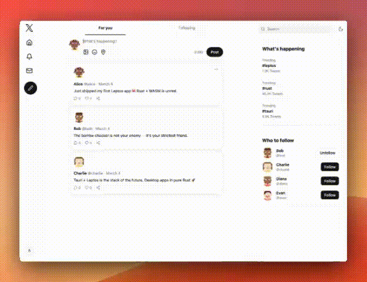

# Twitter Clone



## Requirements

You need to have Leptos (nightly), Just, Tauri, and PSQL on your machine.
If not already, you can refer to [PREREQUISITES.md](PREREQUISITES.md).


## Setup the project

```bash
# Install Tailwind CSS
pnpm install

# Create the DB (+ seed)
just reset_db
```

## Run the project

```bash
cargo leptos watch  # For Web
cargo tauri dev     # For desktop
just run_ios        # For iOS
just run_android    # For Android
```


## License

MIT License - see [LICENSE](LICENSE) for details.
